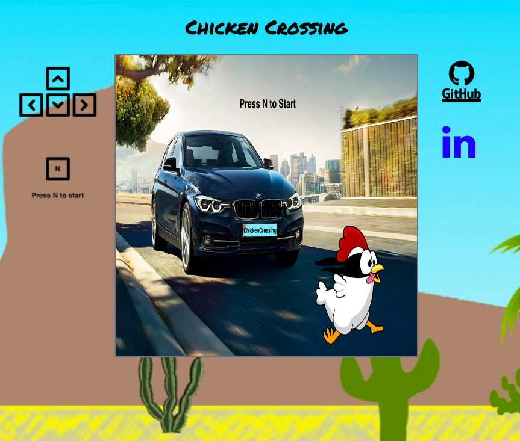
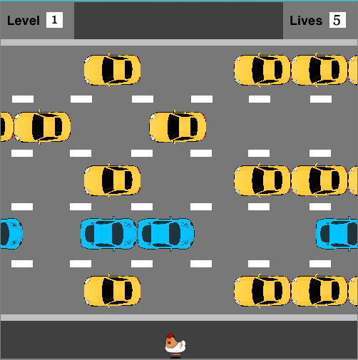

## Chicken Crossing

[live](http://sywu.us/ChickenCrossing/)

#### About
Chicken Crossing is a classic game of Frogger. Using the arrow keys, player can help the chicken across the road.

#### Controls
Using arrow keys:
##### UP
- move the chicken forward
##### DOWN
- move the chicken back
##### LEFT
- move the chicken to the left
##### RIGHT
- move the chicken to the right

#### Difficulty

Game difficulty and car speed increases as the player help the chicken successfully across the road.
- The current game level is displayed at the bottom left corner of the screen.
- As well as the lives of the chicken is also displayed on the top right corner

#### Architecture and Technologies
- Javascript for game logic
- HTML5 Canvas for rendering
- Webpack to bundle and serve scripts

#### Future direction for the project
- Implement chicken hop animation
- Implement chick-carry to increase score
